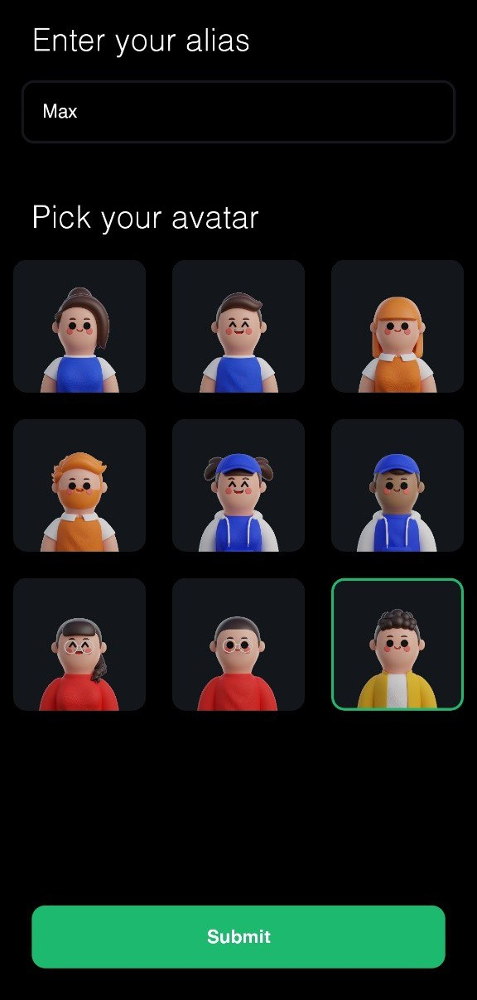

# Chatify 🚀


Chatify is a modern and sleek chat application built using React Native, Expo, TypeScript, Socket.IO, and MMKV. It provides a seamless chatting experience with real-time messaging and features an intuitive user interface.

## Features ✨

- Real-time messaging using Socket.IO
- Secure local storage with MMKV
- Built with React Native and Expo for cross-platform compatibility
- Written in TypeScript for enhanced type safety
- Smooth and responsive user interface
- Easy-to-use and intuitive design

## Technologies Used 🛠️

- React Native
- Expo
- TypeScript
- Socket.IO
- MMKV

## Installation 📲

To run Chatify on your local machine, follow these steps:

1. Clone the repository:
   ```bash
   git clone https://github.com/your-username/chatify.git
   ```
2. Navigate to the project directory:

```bash
cd chatify
```

3. Install dependencies:

```bash
npm install
```

4. Start the Expo development server:

```bash
npm start
```

Open the Expo app on your mobile device and scan the QR code to view the app.

## Screenshots 📷

<div style="display: flex; flex-direction: row; gap: 16px; padding: 16px 0;">
  
  
  
  
</div>

## Download link 🔗

[Download the APK](https://drive.google.com/file/d/1DomHS25_TzHxCi1gBvkd9ITDweVCNEAX/view?usp=sharing)

## Contributing 🤝

Contributions are welcome! If you'd like to contribute to Chatify, please fork the repository and create a pull request.

## License 📝

This project is licensed under the MIT License - see the LICENSE file for details.
